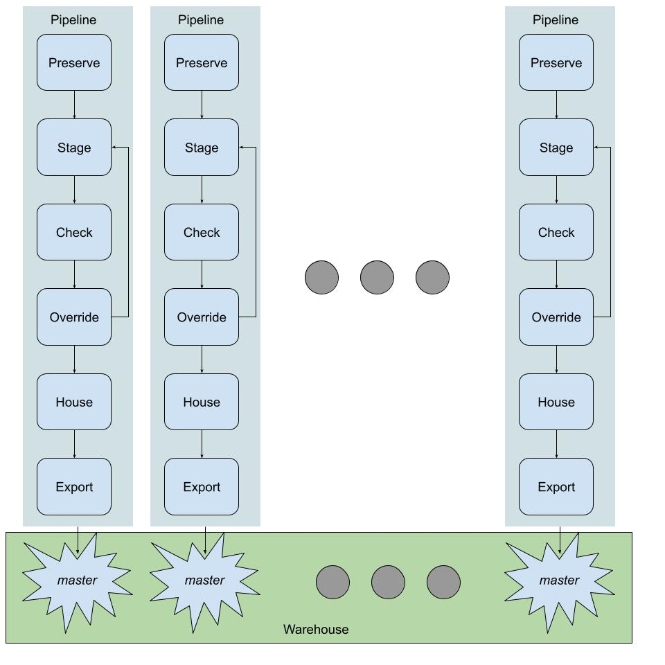

# Bonum Master Data Management (MDM) and Data Warehouse (DWH)
Welcome to the Bonum MDM and DWH system documentation.

# Table of Contents
1. [Purpose](#purpose)
2. [Logical System Diagram](#logical-system-diagram)
3. [Pipeline Steps](#pipeline-steps)
4. [Override System](#override-system)
5. [Pipeline Scheduling System](#pipeline-scheduling-system)
5. [Monitoring System](#monitoring-system)
6. [Preparing For a Datawarehouse Project](#preparing-for-a-data-warehouse-project)
7. [Setting up Batch Pipelines for Warehouses](#setting-up-batch-pipelines-for-warehouses)
8. [Setting up OLTP Pipelines for Warehouses](#setting-up-oltp-pipelines-for-warehouses)
9. [Supporting Concepts](#supporting-concepts)

## Purpose
The purpose of Bonum Master Data Management and Data Warehouse is to provide a framework for building and maintaining data warehouses through a series of steps that acquire original source data, stage and check the data for errors, refine the data via an override feature, publish the data objects into a warehouse, and then export them into different formats such as RDBMS, parquet files, Redis, Snowflake, etc.  so that it can be used by the enterprise.  Following this process, the warehouse becomes the "one-version-of-the-truth".

## Logical System Diagram

## Pipeline Steps
### Acquire
"Acquire" is for managing original source data that is used to construct the warehouse.  This is done by downloading, reading or extracting original vendor data from a data source, then uploading it to a destination and making a virtual latest version of that data on the basis of a time-slice, usually a calendar day, so that that version is known as the "logical" version of the source can be distinguished from previous physical versions of the file, physical versions being temporal versions that may change even during the time-slice of a day.  This step is important because it helps maintain a history of all sources that are being used to create the warehouse.  Without this, original sources may be archived (lost) or replaced so that the original version cannot be procured from the original source location. In short, we need to keep what we processed so that we can rebuild history from nothing.
* Read more about [OLTP Acquire](#more-about-oltp-acquire).

### Stage
"Stage" reads acquired data from what the Acquire step has produced.  The step processes the raw vendor data, normalizing the data into firm-agreed field names, reformatting where needed, filtering or ignoring irrelevant data, and then applying overrides in order to repair data that has failed previously-found errors from a Check having been run.  The end of a stage is a proposed set of updates found when comparing the staged results to the previous days worth of warehoused data for the source in question.  The proposed newly staged data is then made available to the next step, Check.

### Check
"Check" is the most important step.  It applies test to the result of the Stage step.  The  tests check for the "completeness" and "logical" integrity of the data.  A Check failure halts the steps and the failed check details are communicated via files and messages to users monitoring the system.  The monitoring of failures and warnings is handled by a [Monitoring Plug-in](#monitoring-system).  A variety of monitoring tools can be plugged in, e.g. Slack, SMS, Email.  An important and typical procedure following a Check failure is [Override](#override-system).  
* Read more about [Check tests](#more-about-check-tests)

### House
"House" is done immediately after a Check succeeds.  It simply moves the final result of the Stage to the new warehouse master. If any tests during Check had failed, the House step is not run automatically.  The details for Check results will indicate whether it is advisable and under what conditions it might be that it is appropriate for the House step to be run.  The House step can be forced to run if it is found that the Check result is acceptable, as in the case of a warning.  The running of individual steps in the pipeline is handled by a [Pipeline Flow Plug-In](#pipeline-scheduling-system)

### Export
"Export" stores the master object (a single warehouse representation) into a physical representation available for the enterprise, e.g.  CSV, Parquet, feather, HDF5, Snowflake.  A master is specified for each object in the data warehouse, as defined by the data being modelled.  Typically, a data warehouse will be a logical umbrella that includes several related warehouse masters, each of which is managed by an individual pipeline.

## Override System
The Override System allows for manual changing of data without disturbing an original source of data, and overrides can be end-dated so they are no longer applied when the owner of source data makes corrections.  It includes a database and a GUI that allows a support person to override individual data elements of the Source data.

### Override GUI
An override is controlled by a relational database, where the key is the source, the file and the valid-from through valid-to date.  There will also be a specific field that uniquely identifies the record in the staged data (see Stage step).  The key field is matched with the value in the database, and the field to be repaired is matched for the old value and the old value is replaced with the new value.

### Override Logic
The override is applied during Stage where a lookup of the data to repair is performed in the Override DB by the key mentioned above.  The software is run as a decorator and replaces the old value with the corrected value according to an override key.  An example would be to historically change the salary of an employee if HR had inserted it a day late in the HR database for employee salaries.

## Pipeline Scheduling System
A pipeline or job execution control system can be plugged in. Examples of such systems are Apache airflow, Jenkins.  Most systems will have a way to declare job dependencies and also be able to display an interactive GUI for step monitoring and step operations, such as running or cancelling a step.

## Monitoring System
The Monitoring system allows any communication stack to be plugged in for visibility, e.g. Slack with status tracked and visible to the enterprise.  When notification of a certain priority level or type is produced, it appears in the chosen medium, and if that medium supports updating status, a user can mark an item with a status such as "In Progress",
"Completed", etc.

<!--
Firms sometimes have configuration for defining pipeline.
Otherwise use off the shelf products, Jenkins is easy setup and GUI.

### Pipeline Dependency Definition
Configuration files are supplied to define the steps and arguments to run
for the steps.  The arguments to the pipeline commands, implememented as
a Linux CLI, differ for each pipeline.  One step indicates the next step
to be executed after successful completion.

### Pipeline GUI
The pipeline status should be visible in a GUI so that operators can notice
when something is failed and needs investigation.  If a Check step failure
is deemed to be acceptable, then the House step can be run by clicking on
the pipeline step in the GUI and instructing the GUI to Run the step.
-->

## Setting up Batch Pipelines for Warehouses
In practice, a firms data is composed of several interdependent warehouse master
objects that are related by keys.

The management of a single warehouse master is the job of a single pipeline process
as defined above.  Pipelines are sequenced together in dependency order so that
a master (e.g. customer) that is required by another master (e.g. order) is refreshed
first and then results in the refreshing of any dependent master.

## Setting up OLTP Pipelines for Warehouses
OLTP updates are handled by a realtime pipeline that is started when
changes to the source data are detected.  A realtime pipeline still goes through
the same steps as mentioned above, except the Acquire step is not needed as that
is provided via a GUI or transactional updates to the source in question.

## Preparing for a Data Warehouse Project
These are the typical steps involved in creating a data warehouse from Source data.

1. Model Source Data
* Understand what data is needed from Source
* Obtain pre-existing models
* Work with data owner to identify objects, keys, relationships, sizes, frequencies
* Understand fundamental completeness and logical rules
2. Create "Acquire" Code
* Identify origin of Source data, e.g. web-scrape, SQL Table(s), flat file, http, ftp, RPC, REST API
* Customize Source classes
3. Create "Stage" Code
* Encode relationships with other data objects (represented as other warehouses)
* Define firm warehouse field names for Source
* Define transformations for Source
* Create CRUD Code for Source
4. Create "Check" Tests
* Define completeness checks
* Define logical checks
* Categorize check severity as critical, warning or info
5. Create "Export" Rules
* Map Master to Warehouse physical layer, e.g. master object maps into Snowflake table
6. Create Pipeline Schedule
* Using the plug-in, create schedules for acquire, stage, check, house
7. Create APIs for Unified Data Warehouse access
* Develop suitable APIs as contracts for accessing warehouse
* See [Warehouse API](#more-about-warehouse-apis)

# Supporting Concepts

## More About OLTP Acquire
OLTP Acquire is the hooking of the warehouse pipeline up to an OLTP source, i.e. a real-time
updating of a database or other source of data such as a realtime feed of price data.

## More About Check Tests
All tests can be related to completeness and logical categories of checks.
### Completeness
A successful "completeness" test makes sure the key that uniquely identifies the data
element is present as expected and has not been removed.
An "expected removal" would be due to some defined expiration policy for
a data element, whereas "unexpected removal" would be the opposite -- the
data appeared at one time in history, should still be present but has
been removed erroneously due to how the data was produced.
### Logical
A successful "logical" test makes sure the data is correct logically according
to the rules about the data.  For example, if an "order warehouse" contains Order objects
for Customers, the "customer warehouse" must have the related customer object contained in it.

## More About Warehouse APIs
The unified data warehouse will be made up of several warehouse master objects. It is typical that an API (e.g. REST API) is developed to provide access to the unified warehouse (rather than raw SQL queries).  An example would be, there may be a Customer, Order and Sales master all interlinked by various keys.  An API to provide Customer orders related to associated Sales would be built to query the masters and provide results to a client.  One reason for developing APIs atop the warehouse physical storage is for caching of results so that scaling can be managed as usage of the warehouse increases.

# More Information
For more information about these concepts, please contact [Bonum Technologies](mailto:mark@gobonum.com)